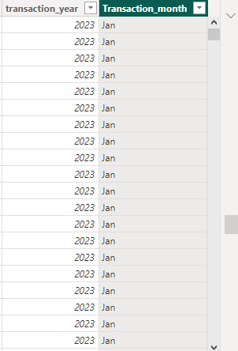

# Coffee Shop Sales Report

## Introduction:
This documentation analyzes the dataset of a small coffee shop chain based in New York City, focusing on coffee and tea sales performance over the past three months (April-June 2023). Since understanding product performance and sales trends is important for informed decision-making within any industry, this analysis aims to uncover valuable insights to help the coffee shop optimize its product offerings, pricing, and marketing efforts. 

#### Tool Used: Power BI

## The Dataset: 
The Dataset from: Maven Analytics. 
Contains 1789404 records and 11 fields with names like;
- transaction_id: Unique identifier for each transaction.
- transaction_date: Date when the transaction occurred
- transaction_time: Time of the transaction
- transaction_qty: Quantity of products purchased in a transaction.
- store_id: Unique identifier for each store location.
- store_location: Name or description of the store's physical location.
- product_id: Unique identifier for each product sold.
- unit_price: Price of a single unit of the product in the transaction.
- product_category: General category to which the product belongs
- product_type: Specific type or variant of the product
- product_detail: Additional details about the product

## Problem Statement: 
Here are the questions/insights your manager would like to see
1) We only want to look at the recent 3 months sales, nothing more. 
2) I know we have a variety of products, but we only want to focus on Coffee and Tea. Not loose tea, coffee beans, just Coffee and Tea.
3) How did our locations perform sales-wise with Coffee and Tea? Did you see any correlations based on location or type of coffee/tea? 
4) Do we have a best seller? Is there some coffee or tea that you'd recommend we remove? 
5) Can we see how each service size (Small, Regular, Large) performed sales-wise for coffee and tea? We want to see what our customers are mostly buying so we can possibly move our prices around.

## Data Prepartation:
 I cleaned the data prior to the analysis to be confident in the insights drawn from the data. No duplicate were found. 
 
 - A column for service size was missing, prompting the creation of a conditional column for Service Size.

   

- Created a calculated column for Transaction month and transaction year
  
  

## Key Insights:
- The total revenue generated during the last three months is $295k.
- Focusing on two major products (Coffee and Tea), the total revenue generated for Coffee is $171k and for Tea is $124k.
- Three major locations were identified: Astoria, Hell's Kitchen, and Lower Manhattan. Astoria had the highest sales for both coffee at $57k and tea at $43k, followed by Hell's Kitchen with coffee sales at $58k and tea at $41k, and Lower Manhattan with coffee sales at $56k and tea at $40k.
- The best-selling coffee product is Barista Espresso, generating $58k in sales. The least selling product is Brewed Green Tea, which brought in $15k in revenue. However, when considering this products, customer preferences, costs, and marketing strategies, removing a product should not be solely based on sales figures.
- Regarding the service size (Large, Regular, Small) of coffee and tea products, the best-selling categories are Tea (Large), Tea (Regular), and Coffee (Large).

## The Report:

  

  
